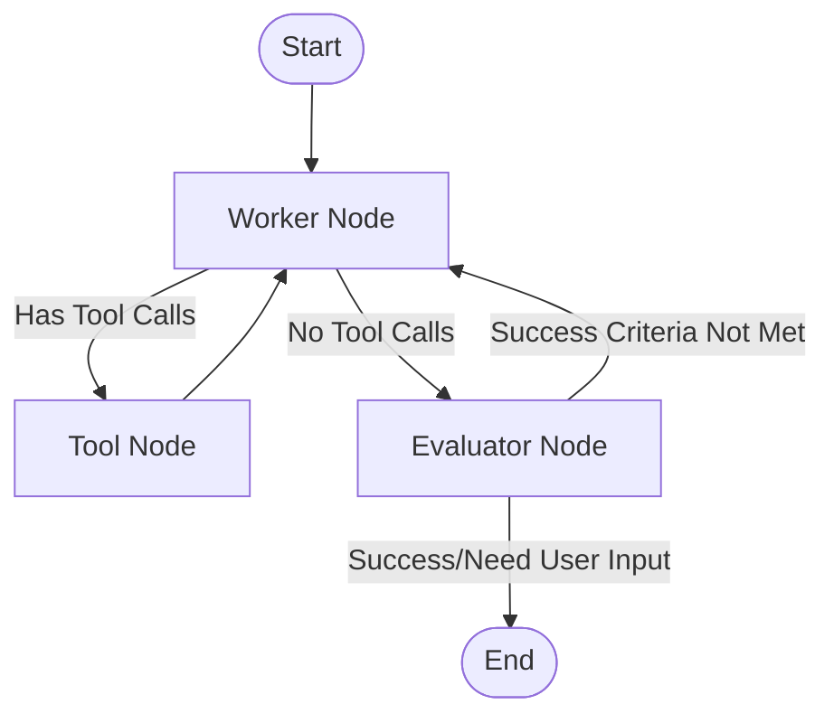

# 🤖 Personal AI Assistant

An intelligent, agentic personal assistant powered by LangGraph and advanced AI tools. This application provides a comprehensive AI assistant capable of web browsing, code execution, file management, research, and more through an intuitive Streamlit interface.

## 🎯 Features

- **Multi-Agent Architecture**: Built with LangGraph for sophisticated workflow management
- **Comprehensive Tool Integration**: 6+ powerful tools for various tasks
- **Interactive Web Interface**: Modern Streamlit UI with real-time chat
- **Autonomous Task Execution**: Self-evaluating AI that iterates until success criteria are met
- **Session Management**: Persistent conversations with memory
- **Error Recovery**: Robust error handling and graceful degradation

## 🏗️ Architecture

### LangGraph Workflow

The assistant uses a sophisticated graph-based architecture with three main nodes:



### Agent Descriptions

#### 1. **Worker Agent** 🔧
- **Role**: Main AI agent that processes user requests
- **Capabilities**: 
  - Understands user intentions and requirements
  - Plans multi-step task execution
  - Utilizes available tools strategically
  - Maintains context across iterations
- **Model**: GPT-4o-mini with tool binding

#### 2. **Tool Execution Node** ⚙️
- **Role**: Executes tool calls and returns results
- **Capabilities**:
  - Manages tool invocation
  - Handles tool errors gracefully
  - Returns structured results to Worker
- **Framework**: LangGraph ToolNode

#### 3. **Evaluator Agent** 🔍
- **Role**: Assesses response quality and task completion
- **Capabilities**:
  - Evaluates against user-defined success criteria
  - Provides detailed feedback on work quality
  - Determines if additional iterations are needed
  - Identifies when user input is required
- **Model**: GPT-4o-mini with structured output

## 🛠️ Available Tools

### 1. 🌐 Web Browser Tool (Playwright)
- **Capabilities**: 
  - Navigate to any website
  - Click elements and interact with pages
  - Fill out forms and submit data
  - Extract information from web pages
  - Handle dynamic content and JavaScript
- **Use Cases**: Web scraping, form automation, research, monitoring

### 2. 🔍 Web Search Tool (Google Serper API)
- **Capabilities**:
  - Search the internet for current information
  - Get real-time search results
  - Find recent news and updates
- **Use Cases**: Fact-checking, research, current events

### 3. 🐍 Python REPL Tool
- **Capabilities**:
  - Execute Python code in real-time
  - Perform mathematical calculations
  - Data analysis and visualization
  - Algorithm implementation and testing
- **Use Cases**: Calculations, data processing, code testing

### 4. 📁 File Management Tool
- **Capabilities**:
  - Create, read, write, and delete files
  - Manage directories and file structure
  - Handle various file formats
- **Use Cases**: Document creation, data storage, file organization

### 5. 📚 Wikipedia Tool
- **Capabilities**:
  - Query Wikipedia for encyclopedic information
  - Access detailed articles and summaries
  - Research historical and factual information
- **Use Cases**: Research, fact verification, educational content

### 6. 📱 Push Notification Tool (Pushover)
- **Capabilities**:
  - Send push notifications to your devices
  - Alert on task completion
  - Provide status updates
- **Use Cases**: Task alerts, monitoring, reminders

## 🚀 Installation & Setup

### Prerequisites
- Python 3.8+
- OpenAI API key
- Google Serper API key (optional, for web search)
- Pushover credentials (optional, for notifications)

### Installation Steps

1. **Clone the repository**:
```bash
git clone <repository-url>
cd personal-ai-assistant
```

2. **Install dependencies**:
```bash
pip install -r requirements.txt
```

3. **Install Playwright browsers**:
```bash
playwright install chromium
```

4. **Set up environment variables**:
Create a `.env` file in the root directory:
```env
OPENAI_API_KEY=your_openai_api_key_here
SERPER_API_KEY=your_serper_api_key_here  # Optional
PUSHOVER_TOKEN=your_pushover_token_here   # Optional
PUSHOVER_USER=your_pushover_user_here     # Optional
```

5. **Run the application**:
```bash
streamlit run app.py
```

## 💡 Usage Examples

### Simple Tasks

**Mathematical Calculations**:
```
User: "Calculate the compound interest on $10,000 invested at 5% annually for 10 years"
Success Criteria: "Provide the exact amount with calculations shown"
```

**Web Research**:
```
User: "Find the current stock price of Apple and create a summary"
Success Criteria: "Include current price, change from yesterday, and brief analysis"
```

### Complex Multi-Tool Tasks

**Research and Analysis Project**:
```
User: "Research the latest developments in quantum computing, create a summary document, and send me a notification when complete"
Success Criteria: "A comprehensive 2-page document covering recent breakthroughs, key companies, and future prospects, saved as a file"

Expected Tool Usage:
1. Web Search → Find recent quantum computing news
2. Web Browser → Visit relevant websites for detailed information
3. Wikipedia → Get background information on quantum computing
4. Python REPL → Analyze any data or create visualizations
5. File Management → Create and save the summary document
6. Push Notification → Alert user when complete
```

**E-commerce Price Monitoring**:
```
User: "Monitor prices of iPhone 15 Pro on Amazon and Best Buy, compare them, and create a price comparison chart"
Success Criteria: "A visual chart showing price differences with recommendations"

Expected Tool Usage:
1. Web Browser → Navigate to Amazon and Best Buy
2. Web Browser → Extract product prices and details
3. Python REPL → Process price data and create charts
4. File Management → Save the comparison chart
5. Push Notification → Alert if significant price differences found
```

**Data Analysis Workflow**:
```
User: "Download cryptocurrency data, analyze the correlation between Bitcoin and Ethereum prices over the last month, and create a report"
Success Criteria: "Statistical analysis with correlation coefficient and visual charts, saved as both data files and report"

Expected Tool Usage:
1. Web Search → Find cryptocurrency data sources
2. Web Browser → Access and download price data
3. Python REPL → Perform correlation analysis and create visualizations
4. File Management → Save data files and analysis report
5. Wikipedia → Get background information on cryptocurrencies
```

**Content Creation and Research**:
```
User: "Research the history of artificial intelligence, create a timeline, and write a blog post about its evolution"
Success Criteria: "A well-structured blog post with accurate timeline and references, ready for publication"

Expected Tool Usage:
1. Wikipedia → Get foundational AI history information
2. Web Search → Find recent AI developments and milestones
3. Web Browser → Visit authoritative sources for detailed information
4. Python REPL → Create timeline visualizations
5. File Management → Save the blog post and timeline files
```

## 🎛️ Configuration Options

### Success Criteria
Define what constitutes a successful response:
- **Specific**: "Provide exact numbers with sources"
- **Comprehensive**: "Include background, current status, and future implications"
- **Actionable**: "Provide clear recommendations with pros and cons"

### Tool Configuration
- Browser tools can run in headless or GUI mode
- File operations are sandboxed to the `sandbox/` directory
- Python execution is isolated for security

## 🔧 Advanced Features

### Memory and Context Management
- Session-based memory using LangGraph checkpointers
- Conversation history maintained across interactions
- Context-aware responses building on previous exchanges

### Error Handling and Recovery
- Graceful degradation when tools are unavailable
- Automatic retry mechanisms for transient failures
- Comprehensive error reporting and logging

### Workflow Customization
- Configurable recursion limits for complex tasks
- Success criteria evaluation for quality control
- User input detection for clarification needs

## 🚨 Important Notes

### Browser Security
- Playwright runs in a sandboxed environment
- No localStorage/sessionStorage in Streamlit artifacts
- All data stored in memory during sessions

### API Rate Limits
- OpenAI API usage scales with task complexity
- Search API calls are optimized to minimize usage
- Implement rate limiting for production deployments

### Resource Management
- Browser instances are properly cleaned up
- Memory usage monitored for long-running sessions
- Automatic resource cleanup on session end

## 🤝 Contributing

1. Fork the repository
2. Create a feature branch (`git checkout -b feature/amazing-feature`)
3. Commit your changes (`git commit -m 'Add some amazing feature'`)
4. Push to the branch (`git push origin feature/amazing-feature`)
5. Open a Pull Request

## 📝 License

This project is licensed under the MIT License - see the [LICENSE](LICENSE) file for details.

## 🔗 Dependencies

- **LangGraph**: Graph-based AI workflow framework
- **LangChain**: AI application development framework
- **OpenAI**: Large language model API
- **Playwright**: Web automation and browser control
- **Streamlit**: Web application framework
- **Various tool-specific libraries**: See requirements.txt for complete list

## 📞 Support

If you encounter issues:
1. Check that all environment variables are properly set
2. Ensure Playwright is installed with `playwright install chromium`
3. Verify API keys have sufficient credits/permissions
4. Check the console logs for detailed error messages

For additional support, please open an issue in the repository.

---

**Built with ❤️ using LangGraph, OpenAI GPT-4, and Advanced Tool Integration**
